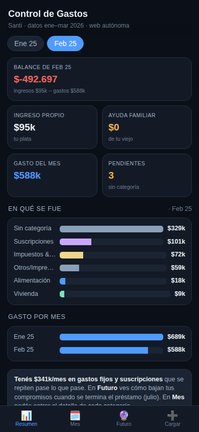

# 💸 Control de Gastos — pipeline de finanzas personales

Automatización end-to-end que convierte los resúmenes de cuenta de un banco (PDF) y de
Mercado Pago (CSV) en una app web de control de gastos, sin carga manual: parsea, limpia,
categoriza y proyecta los compromisos futuros de forma automática.

> Proyecto personal y a la vez pieza de portfolio de **ingeniería de datos + BI**.
> Los datos del demo son **ficticios**; los datos reales nunca se suben al repo.



---

## El problema

Tenía gastos repartidos en cinco cuentas (dos tarjetas de crédito, débito, una billetera en
dólares y Mercado Pago) y ni idea de en qué se me iba la plata. Las planillas manuales que
intenté antes eran demasiado trabajo y las abandonaba. La solución tenía que ser **automática**
en lo repetitivo (resúmenes) y de **mínima fricción** en lo variable (Mercado Pago).

## Qué hace

- **Ingesta + parseo** de resúmenes de BBVA (PDF, con `pdftotext`) y Mercado Pago (CSV).
- **Validación contable**: cada import se cuadra contra el total de control del resumen.
- **Categorización automática** con reglas configurables (un "machete" texto → categoría) +
  memoria de destinatarios editable.
- **Compensación de transferencias internas** entre cuentas propias (no cuentan como gasto).
- **Proyección de compromisos futuros** (cuotas de tarjeta, préstamos, suscripciones).
- **App web** mobile-first (una sola página, sin backend) para ver y categorizar desde el celu.

## Arquitectura

```
 Resúmenes            PYTHON PIPELINE                       CONSUMO
 (PDF / CSV)   ┌──────────────────────────────┐    ┌───────────────────────┐
   data/raw ──▶│ parse → transform → build_app│──▶ │ app web  +  Looker Studio│
               └──────────────────────────────┘    └───────────────────────┘
                 config-driven (config/*.csv,yaml)     Google Sheet (base)
```

1. **parse** (`src/parse_statements.py`) — PDF/CSV → tabla normalizada.
2. **transform** (`src/transform.py`) — limpieza, categorización, internas, futuros → `app_data.json`.
3. **build_app** (`src/build_app.py`) — genera la app web de una sola página.

Todo es **config-driven**: reglas, categorías y cuentas viven en `/config`, así el proyecto
se **replica** para otra persona sin tocar el código.

## Stack

`Python` (ETL) · `pdftotext` (poppler) · `Google Sheets` (base de datos) ·
`Looker Studio` (dashboards) · `HTML/JS` (app) · `GitHub Actions` (orquestación).

## Correr el demo

```bash
pip install -r requirements.txt         # PyYAML
python src/run_pipeline.py              # usa data/sample (datos ficticios)
open app/index.html                     # abrir la app generada
```

Con datos reales: poné los resúmenes en `data/raw/` y corré `python src/run_pipeline.py --real`.

## Estructura

```
config/       reglas.csv · categories.csv · accounts.yaml · commitments.yaml
src/          parse_statements.py · transform.py · build_app.py · run_pipeline.py
data/         raw (gitignored) · interim · processed · sample (demo ficticio)
app/          index.html  (app generada)
.github/      workflows/pipeline.yml
```

## Privacidad

`data/raw/`, `interim/` y `processed/` están en `.gitignore`: **los números reales nunca salen
de la máquina**. El repo público muestra el *código y la arquitectura*, corriendo sobre datos
de ejemplo inventados.

## Roadmap

- [x] Pipeline de parseo + categorización + app web
- [x] Proyección de compromisos futuros
- [ ] Sincronización con Google Sheet (bridge Apps Script)
- [ ] Dashboards en Looker Studio
- [ ] Recordatorios automáticos (carga diaria y de resúmenes)
- [ ] Importador in-app

---

Hecho por Santiago Villanueva — Contador Público & Data/BI Analyst.
